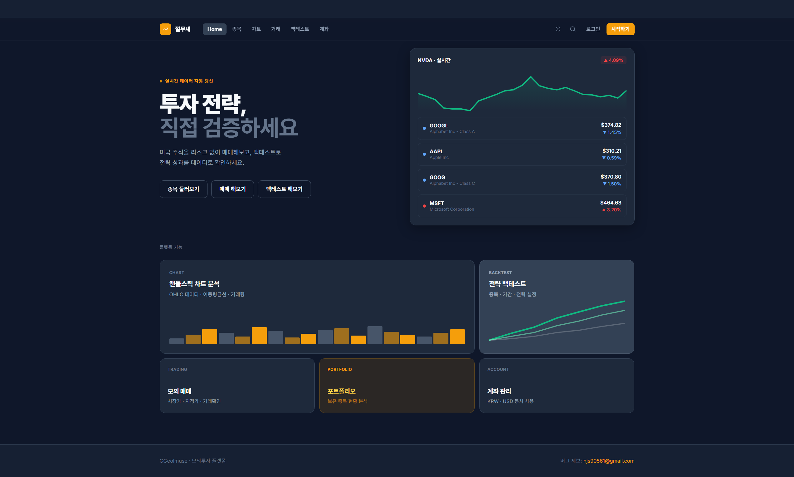

# GGeolmuse

> 미국 주식 데이터로 투자 전략을 백테스팅하는 마이크로서비스 플랫폼

**Live Demo**: https://ggeolmuse.com — 평일 07:30~19:00 (KST) 에만 띄워둡니다

[](https://github.com/musqat/ggeolmuse/actions)
[](https://github.com/musqat/ggeolmuse/actions)

<div align="center">
  
</div>

> 야간·주말은 내려둡니다. 꺼져 있는 동안 접속하면 다음 가동 시각을
> 안내하는 페이지가 뜹니다 ([Cloudflare Worker](cloudflare/offline-notice/worker.js)).

<br>

## 하는 일

NYSE · NASDAQ · NYSE ARCA 상장 약 9,000 개 종목의 일별 가격으로 투자 전략을 검증한다.
환율 변동, 배당 재투자, 거래 수수료까지 반영해 실제 매매에 가까운 수익률을 낸다.

```
종목 · 기간 · 전략 선택
        ↓
전략 실행   단순 매수 / 적립식 / 조건부 매매
        ↓
보정        환율(KRW↔USD) · 배당 재투자 · 수수료 · 슬리피지
        ↓
결과        수익률 · 자산 추이 · 전략 간 비교
```

<details>
<summary><b>기능 목록</b></summary>

<br>

- 실시간 시세 조회와 과거 OHLC 데이터 제공
- 투자 전략 다섯 가지 (단순, 적립식, 조건부 매매, 전략 비교, 종목 비교)
- 환율을 반영한 원화·달러 수익률
- 배당금 자동 재투자 시뮬레이션
- 거래 수수료와 슬리피지 반영
- AI 종목 기술 분석 — 지표 기반 챗봇, 차트에서 원클릭

</details>

<br>

## 구조

서비스 일곱 개(Java 6 + Python 1). 서비스별 독립 배포와 스케일링을 다뤄보는 것이 목적이고
**실제 운영은 단일 EC2 한 대**다.

```
                    Traefik IngressRoute
                            │
                    Gateway Server (8070)
         JWT 검증 · 라우팅 · Rate Limit · Circuit Breaker
                            │
     ┌──────────┬───────────┼───────────┬──────────┐
     ▼          ▼           ▼           ▼          ▼
   User       Trade      Backtest   Market-Data   Chat
   8080       8081        8082        8083       8000
  인증·계좌   거래·포트폴리오  전략 시뮬  시세 수집·제공  AI 분석
     │          │           │           │
     └──────────┴─────┬─────┴───────────┘
                      │
        PostgreSQL · Redis · Kafka
```

Feign 은 답이 있어야 다음 줄이 진행되는 조회에 쓰고 Kafka 는 답이 필요 없는 사후 통지에 쓴다.
설정은 Config Server 가 [ggeolmuse-config](https://github.com/musqat/ggeolmuse-config) 에서
읽어 배포한다. 코드와 분리해 둬서 cron 이나 수집 상한 같은 값은 재배포 없이 바꾼다.

<details>
<summary><b>서비스별 상세</b> — 각 서비스 README</summary>

<br>

| Service | 역할 | |
|---|---|---|
| **Config Server** | 중앙 설정 관리 | [📄](config-server/README.md) |
| **Gateway Server** | 라우팅, JWT 검증, Rate Limit | [📄](gateway-server/README.md) |
| **User Service** | 인증, 계좌 관리, 환전 | [📄](user-service/README.md) |
| **Trade Service** | 거래 실행, 포트폴리오 | [📄](trade-service/README.md) |
| **Market Data Service** | 시세 수집·제공 | [📄](market-data-service/README.md) |
| **Backtest Service** | 전략 백테스팅 | [📄](backtest-service/README.md) |
| **Chat Service** | AI 기술 분석 (FastAPI) | [📄](chat-service/README.md) |

인프라 구성과 비용 최적화는 [helm/README.md](helm/README.md) 에 있다.
서비스 설정은 별도 저장소 [ggeolmuse-config](https://github.com/musqat/ggeolmuse-config) 에 있다.

</details>

<details>
<summary><b>디렉터리</b></summary>

<br>

```
ggeolmuse/
├── gateway-server/       API Gateway (WebFlux)
├── config-server/        중앙 설정
├── user-service/         인증 · 계좌
├── trade-service/        거래 · 포트폴리오
├── market-data-service/  시세 수집 · 제공
├── backtest-service/     전략 시뮬레이션
├── chat-service/         AI 기술 분석 (FastAPI)
├── ggeolmuse-bom/        공통 라이브러리 (예외 · 로깅 · 유틸)
├── messaging/            Kafka 공통 라이브러리
├── frontend-web/         React
├── helm/                 Helm 차트 · ArgoCD
├── k6/                   부하 테스트 스크립트
└── terraform/            EC2 스케줄러 · 알람
```


</details>

<br>

## 기술 스택

| 영역 | 기술 |
|---|---|
| Backend | Java 21 · Spring Boot 3.3 · Spring Cloud Gateway · Spring Security |
| AI | FastAPI (Python) · OpenAI gpt-4o / gpt-4o-mini |
| Data | PostgreSQL · Redis · Kafka |
| Frontend | React · TypeScript · Vite |
| Auth | Keycloak (OAuth2 / JWT) |
| Resilience | Resilience4j — CircuitBreaker · Retry · TimeLimiter · Bulkhead |
| Infra | Kubernetes (K3s) · Helm · ArgoCD · Docker |
| 관측 | Prometheus · Grafana · Tempo (OpenTelemetry) · Loki |
| Test | JUnit 5 · Mockito · Vitest · k6 |

<br>

## 테스트

백엔드 **703 개**, 프론트 **97 개**. 여섯 서비스가 CI 에서 같은 명령을 탄다.

| 서비스 | 테스트 |
|---|---|
| market-data-service | 235 |
| user-service | 204 |
| backtest-service | 155 |
| trade-service | 109 |
| frontend-web | 97 |

<details>
<summary><b>커버리지와 그 한계</b></summary>

<br>

`Q*`, `*Config`, DTO, entity 를 제외한 수치다. 롬복이 만드는 게터·빌더가 포함되면
숫자는 올라가지만 실제 검증 정도를 나타내지 못한다.

| 서비스 | 라인 | 분기 |
|---|---|---|
| backtest | 68.4% | 55.6% |
| trade | 55.1% | 52.8% |
| user | 44.7% | 25.2% |
| market-data | 27.2% | 31.4% |

market-data 가 낮은 이유는 수집 파이프라인이 대부분 외부 API 호출이라서다.
파서와 매퍼는 붙였고 수집 자체는 아직이다. 낮은 걸 알고 두는 것과 모르는 것은 다르다.

프론트 테스트는 화면 개수가 아니라 **실제로 틀렸던 곳**을 기준으로 골랐다.
`toISOString()` 이 UTC 라 날짜가 밀리던 것 같은 결함들이고
전부 [문제 해결](docs/problem-solving.md) 에 기록돼 있다.

</details>

<br>

## 성능

측정한 조건을 같이 적는다. 조건이 빠진 수치는 나중에 자기가 자기를 속인다.

**Bulk API — 호출 2,000 회 → 2 회**

백테스트가 기간 내 날짜를 하루씩 개별 호출했다. 5년치면 약 2,000 회다.
범위를 한 번에 받는 API 로 바꿔 100 초가 1.5 초가 됐다.

**Redis 캐시 — 같은 백테스트에서 1.2s → 150ms**

서버가 빨라진 게 아니라 캐시 미스와 히트의 차이다. 같은 요청을 캐시가 있을 때와
없을 때 돌린 값이다.

**캐시 히트율 — 기간 단위에서 일자 단위로**

기간 단위로 캐시하면 요청 범위가 조금만 달라도 키가 어긋나 히트가 거의 없다.
일자별로 쪼개니 겹치는 날짜가 재사용된다. 77% 를 봤지만 **표본이 적어 대푯값으로 보긴 어렵다.**
이 변경에는 대가도 있었다 — 범위 조회가 날짜 수만큼 왕복하게 되어 다른 장애를 만들었다.

<details>
<summary><b>부하 테스트 (k6) — 게이트웨이가 앱 여력의 6% 만 통과시킨다</b></summary>

<br>

조회 API (`symbols` / `price` / `ohlc`) 기준.

| 구간 | 처리량 | p95 | 5xx |
|---|---|---|---|
| 게이트웨이 경유 | 202 rps | 28.8ms | 0 |
| 우회 (50 VU) | 3,368 rps | 29.8ms | 0 |
| 우회 (250 VU) | 3,339 rps | 177ms | 0 |

실패율이 89.87% 인데 응답은 p95 12ms 였다. 느려서 실패하는 것과 빠르게 거절당하는 것은
다르고, 후자였다. 87% 가 429 였고 게이트웨이 `replenishRate: 200` 과 일치했다.

**단, 3,350 rps 는 앱의 한계가 아니다.** 그 시점에 market-data 프로세스 CPU 는 38.7% 인데
호스트 전체는 67.8% 였다. 부하 생성기를 같은 PC 에서 돌린 탓에 측정 환경이 먼저 포화했다.
"게이트웨이가 앱 여력의 6% 만 통과시킨다" 는 말할 수 있어도 "앱이 3,350 rps 를 견딘다" 는
말할 수 없다.

rate limit 값을 아직 바꾸지 않은 이유도 이것이다. 앱의 실제 한계를 모르는 상태에서 문을
넓히면 병목을 게이트웨이에서 앱으로 옮기는 것에 그친다.

</details>

<br>

## 운영

**비용** — 관리형 서비스로 구성하면 월 $650 이었다. 아키텍처는 유지하고 운영 등급만 낮춰
$80 으로 내렸다. EKS→K3s, RDS Multi-AZ→Single-AZ, MSK·ElastiCache→파드 내 실행.
values 파일만 바꾸면 되돌릴 수 있게 환경을 분리했다.

**데이터** — 상장 목록을 받아오면 11,000 개가 넘게 잡힌다. 상장폐지된 것은 지우지 않고
`active=false` 로 내린다. 수집 스케줄러는 `active=true` 인 약 9,000 개만 갱신한다.

**가동 시간** — EventBridge Scheduler 가 EC2 를 평일 07:00 에 켜고 19:00 에 끈다.
인스턴스 시간 기준 월 $49 를 더 아끼는 대신 가동률이 35.7% 가 된다.
비용을 알고 내린 선택이라 README 에 적어둔다.

<details>
<summary><b>배포와 관측</b></summary>

<br>

```
GitHub Actions          빌드 · 테스트 · Trivy 스캔
        ↓
ArgoCD (GitOps)         Helm 차트를 추적해 동기화
        ↓
K3s (EC2 단일 노드)      Traefik IngressRoute 로 진입
```

| 도구 | 용도 |
|---|---|
| Prometheus · Grafana | 메트릭 수집과 시각화 |
| Tempo · OpenTelemetry | 분산 추적 |
| Loki | 로그 집계 |
| ArgoCD | GitOps 배포 |

로컬에서도 같은 관측 스택을 `docker-compose` 로 띄울 수 있다.

**안정성** — Resilience4j 로 CircuitBreaker · Retry · TimeLimiter · Bulkhead 를 걸었다.
서킷은 market-data 를 내렸다 올리며 OPEN → CLOSED 전이를 실제로 확인했다.

</details>

<br>

## 로컬에서 실행

Docker Desktop 이 떠 있으면 한 번에 올라간다.

```bash
git clone https://github.com/musqat/ggeolmuse.git
cd ggeolmuse
bash scripts/local-up.sh
```

접속은 http://localhost:3000, 시드 계정은 `admin@test.com` / `Admin123!` 이다.
AI 챗봇 설정과 주의할 점은 [빌드와 배포](docs/DEPLOY.md) 에 적었다.

<br>

## 만들며 겪은 것

- [시행착오](docs/trial-and-error.md) — 근거를 갖고 정한 것이 확인해보니 반대인 게 여럿이었다. 무엇을 믿었고 무엇으로 갈렸는지
- [문제 해결](docs/problem-solving.md) — 겪은 장애와 버그를 문제 → 원인 → 해결. 감수하기로 한 한계도 함께
