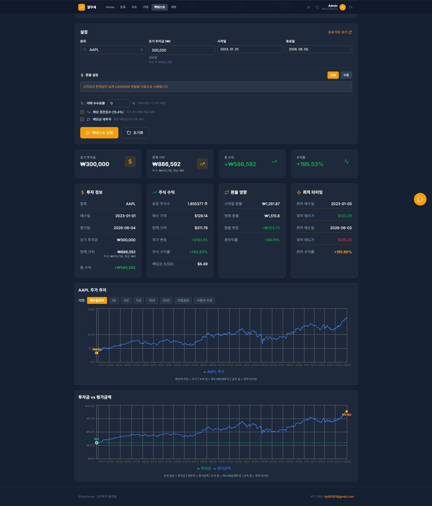
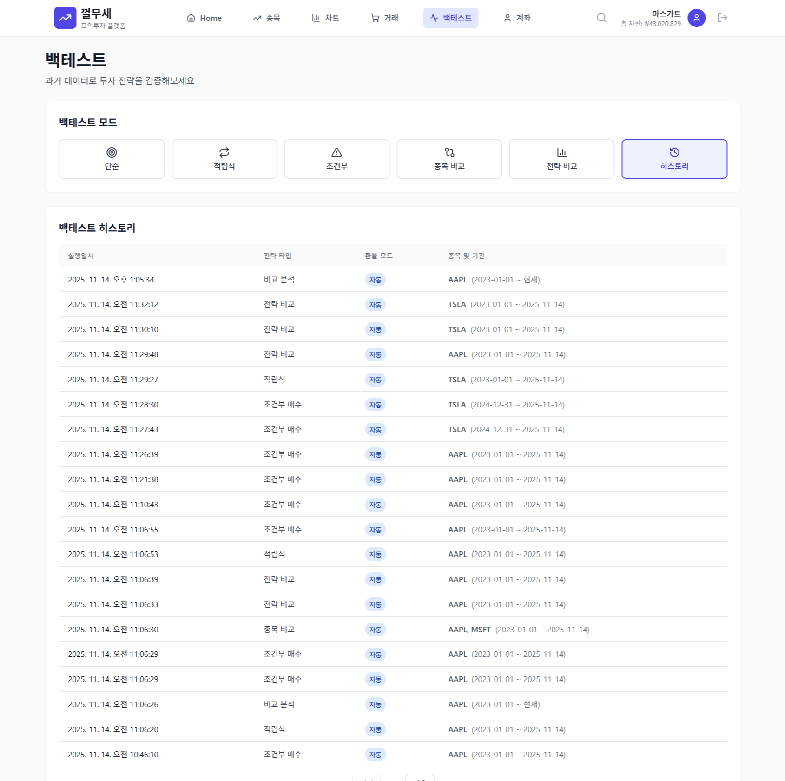

# Backtest Service

투자 전략 백테스팅 시뮬레이션 서비스

## 주요 기능

**5가지 투자 전략**
- **Simple**: 일시불 투자 (특정 시점 일괄 매수)
- **DCA**: 적립식 투자 (Dollar Cost Averaging, 정기 분할 매수)
- **Conditional**: 조건부 매수 (가격 조건 기반 자동 매수)
- **Strategy Comparison**: 전략 간 성과 비교
- **Symbol Comparison**: 종목 간 성과 비교

**추가 기능**
- 배당금 자동 재투자 시뮬레이션
- 환율 설정 (Fixed/Manual)
- 수수료 반영

**의존 서비스:** Market Data Service, Trade Service

<b>화면</b>

 

**백테스트 실행**

**백테스트 내역**

