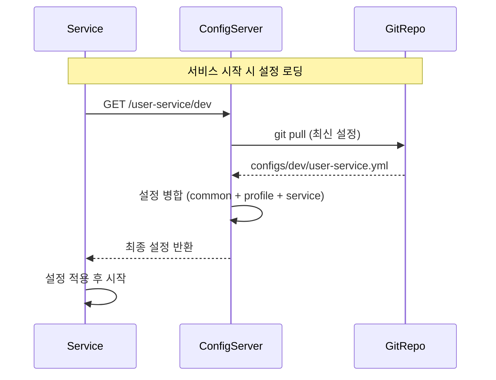

# Config Server

Spring Cloud Config 중앙 설정 관리 서비스

## 주요 기능
- 모든 마이크로서비스의 설정 중앙 관리
- 환경별 설정 분리 (dev, prod)
- 공통 설정 상속 (common)
- 설정 변경 시 재배포 불필요
- Git 기반 설정 버전 관리

## 시스템 내 역할



**시스템 내 책임:**
- 설정 제공: 모든 서비스의 application.yml 제공
- 환경 분리: dev/prod 환경별 설정 관리
- 우선순위 관리: common < environment < service 순서로 병합
- Git 연동: 설정 변경 시 Git에서 자동으로 최신 버전 반영

**설정 로딩 순서:**
```
1. configs/common/application.yml         (전체 서비스 공통)
2. configs/{profile}/application.yml      (환경별 공통)
3. configs/{profile}/{service}.yml        (서비스별)
4. {service}/application.yml              (로컬 기본값)
```

## 설정 구조 및 관리

### 파일 구조
```
ggeolmuse-config/ (Git 저장소)
├── common/
│   └── application.yml              # 전체 서비스 공통 설정
│       ├── HikariCP 커넥션 풀
│       ├── Hibernate 배치 설정
│       ├── Resilience4j 기본값
│       ├── Actuator 설정
│       └── Logging 설정
│
├── dev/                             # 개발 환경
│   ├── application.yml              # dev 공통
│   ├── user-service.yml
│   ├── trade-service.yml
│   ├── market-data-service.yml
│   └── backtest-service.yml
│
└── prod/                            # 운영 환경
    ├── application.yml              # prod 공통
    ├── user-service.yml
    ├── trade-service.yml
    ├── market-data-service.yml
    └── backtest-service.yml
```

### 주요 공통 설정

**HikariCP 커넥션 풀:**
- maximum-pool-size: 10
- minimum-idle: 5
- connection-timeout: 20초
- leak-detection-threshold: 60초

**Hibernate 배치 최적화:**
- batch_size: 20 (N+1 문제 방지)
- fetch_size: 50
- order_inserts/updates: true

**Actuator & Metrics:**
- Prometheus 메트릭 자동 노출
- 모든 서비스에서 /actuator/health, /metrics, /prometheus 활성화
- 서비스별 application tag 자동 추가

### 환경별 설정 분리

**dev 환경:**
- H2 인메모리 데이터베이스
- 로컬 Keycloak (http://keycloak:8080)
- 개발용 SMTP 설정
- 디버그 로깅 활성화

**prod 환경:**
- PostgreSQL (AWS RDS)
- 공개 Keycloak URL (https://ggeolmuse.com/auth)
- 운영 SMTP 설정
- 환경 변수 플레이스홀더 사용 (${DB_HOST}, ${KEYCLOAK_SECRET})

## 운영 가이드

### 설정 적용 방법

**1. 서비스에서 Config Server 연결**
```yaml
spring:
  config:
    import: "optional:configserver:http://config-server:8888"
  cloud:
    config:
      uri: http://config-server:8888
      username: config
      password: config123
```

**2. 프로파일 활성화**
```bash
SPRING_PROFILES_ACTIVE=dev   # 개발 환경
SPRING_PROFILES_ACTIVE=prod  # 운영 환경
```

**3. 설정 우선순위**
```
최종 설정 = common + {profile} + {service} + local
```

예시 (user-service, dev 환경):
```
1. common/application.yml          (HikariCP 설정)
2. dev/application.yml             (H2 DB 공통)
3. dev/user-service.yml            (User Service 전용)
4. user-service/application.yml    (로컬 기본값)
```

### Health Check

**Config Server 상태 확인:**
```bash
curl http://config-server:8888/actuator/health
```

**서비스별 설정 확인:**
```bash
curl http://config-server:8888/user-service/dev
```

응답:
```json
{
  "name": "user-service",
  "profiles": ["dev"],
  "propertySources": [ ... ]
}
```

### 배포 순서

Config Server는 모든 서비스보다 먼저 시작해야 합니다:
```
1. Infrastructure (Redis, Keycloak, PostgreSQL)
2. Config Server ← 여기서 설정 제공
3. Gateway Server
4. Business Services (User, Trade, MarketData, Backtest)
```

**Docker Compose 의존성:**
```yaml
config-server:
  healthcheck:
    test: ["CMD", "curl", "-f", "http://localhost:8888/actuator/health"]

user-service:
  depends_on:
    config-server:
      condition: service_healthy  # Config Server가 준비될 때까지 대기
```

## 데이터베이스 스키마

Config Server는 별도의 데이터베이스를 사용하지 않습니다.
- **Git 저장소**: 모든 설정 파일 버전 관리
