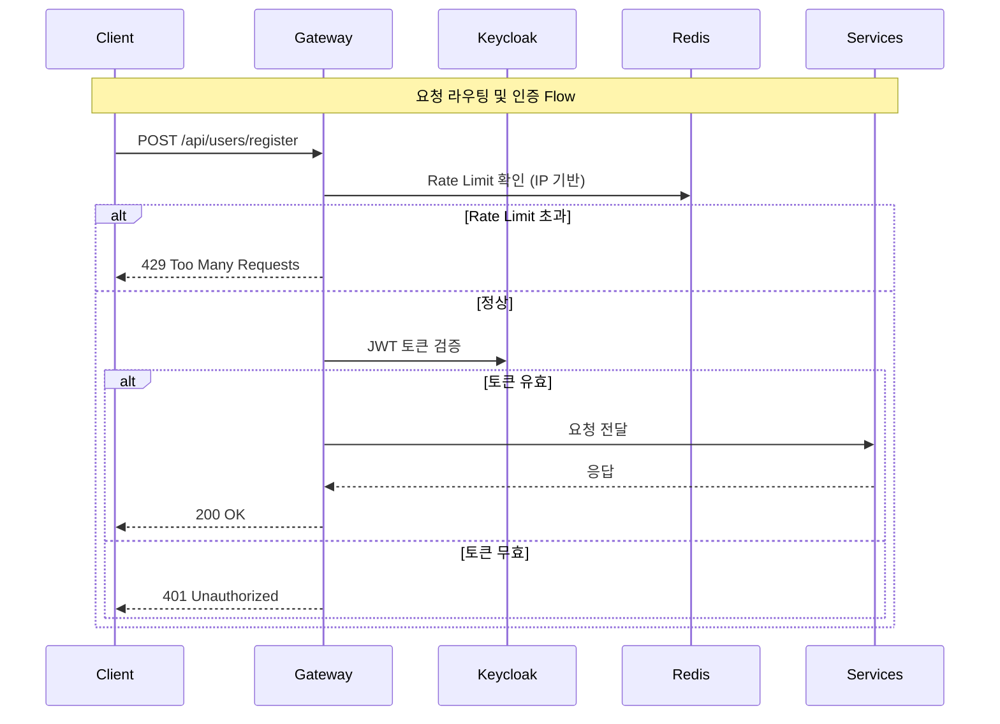

# Gateway Server

Spring Cloud Gateway API Gateway 서비스

## 주요 기능
- 중앙화된 API 라우팅 (모든 요청의 진입점)
- JWT 토큰 검증 (Keycloak 연동)
- Redis 기반 분산 Rate Limiting
- Circuit Breaker (장애 서비스 격리)
- CORS 처리
- API 요청/응답 로깅

## 시스템 내 역할

**시스템 내 책임:**
- 라우팅: 요청 경로에 따라 적절한 서비스로 전달 (/api/users → User Service)
- 인증: JWT 토큰 검증 (Keycloak Public Key로 서명 확인)
- Rate Limiting: IP 기반 속도 제한 (Redis 분산 저장, Token Bucket 알고리즘)
- Circuit Breaker: 장애 서비스 차단 및 Fallback 응답 제공
- CORS: 프론트엔드 CORS 정책 처리

**의존 서비스:**
- Keycloak: JWT 토큰 검증 (JWK Set)
- Redis: Rate Limit 카운터 저장
- Config Server: 라우팅 규칙 및 보안 설정

## 라우팅 및 보안

### 서비스별 경로 매핑
- **User Service** (8080): `/api/users/**`, `/api/auth/**`, `/api/accounts/**`
  - Rate Limit: 100 req/sec, burst 200
- **Trade Service** (8081): `/api/trades/**`, `/api/holdings/**`, `/api/transactions/**`
  - Rate Limit: 150 req/sec, burst 300
- **Market Data Service** (8083): `/api/market/**`, `/api/assets/**`, `/api/candles/**`
  - Rate Limit: 200 req/sec, burst 400
- **Backtest Service** (8082): `/api/backtest/**`
  - Rate Limit: 50 req/sec, burst 100

### Rate Limiting (2-Layer Defense)

**Layer 1: Gateway Level (IP 기반)**
- Redis Token Bucket 알고리즘 사용
- IP별로 요청 카운터 관리
- 초과 시: `429 Too Many Requests` + `Retry-After` 헤더

**Layer 2: Service Level (Resilience4j)**
- 각 서비스 내부에서 추가 Rate Limiting 적용
- Gateway는 외부 클라이언트 보호, Service는 내부 의존성 보호

### Circuit Breaker

**장애 감지 및 격리:**
- 다운스트림 서비스 장애 시 자동 차단
- Fallback 응답: `503 Service Unavailable` 반환
- 3가지 상태: CLOSED (정상) → OPEN (차단) → HALF_OPEN (복구 테스트)

### JWT 검증

**검증 프로세스:**
1. `Authorization: Bearer {JWT}` 헤더 추출
2. Keycloak Public Key로 서명 검증
3. 만료 시간 및 권한(role) 확인
4. 검증 성공 시 다운스트림 서비스로 전달
5. 실패 시: `401 Unauthorized` 응답

### CORS 설정
- 모든 경로(`/**`)에 대해 CORS 허용
- 허용 메서드: GET, POST, PUT, DELETE, PATCH, OPTIONS
- Preflight 요청 캐싱: 3600초

## 모니터링 및 성능

### Actuator Endpoints
- `/actuator/health`: Gateway 상태 확인
- `/actuator/metrics`: Prometheus 메트릭
- `/actuator/gateway/routes`: 라우팅 규칙 조회

### 주요 메트릭
- `spring_cloud_gateway_requests_total`: 총 요청 수
- `spring_cloud_gateway_requests_seconds`: 요청 처리 시간
- `resilience4j_circuitbreaker_state`: Circuit Breaker 상태
- `redis_rate_limiter_remaining`: 남은 Rate Limit

### Reactive 아키텍처
- Spring WebFlux 기반 비동기 Non-Blocking I/O
- Netty 이벤트 루프로 높은 처리량 달성
- 적은 스레드로 다수의 동시 요청 처리
- 연결 타임아웃 3초, 응답 타임아웃 30초

## 데이터베이스 스키마

Gateway Server는 별도의 데이터베이스를 사용하지 않습니다.
- **Redis**: Rate Limit 카운터 임시 저장 (TTL 기반)
