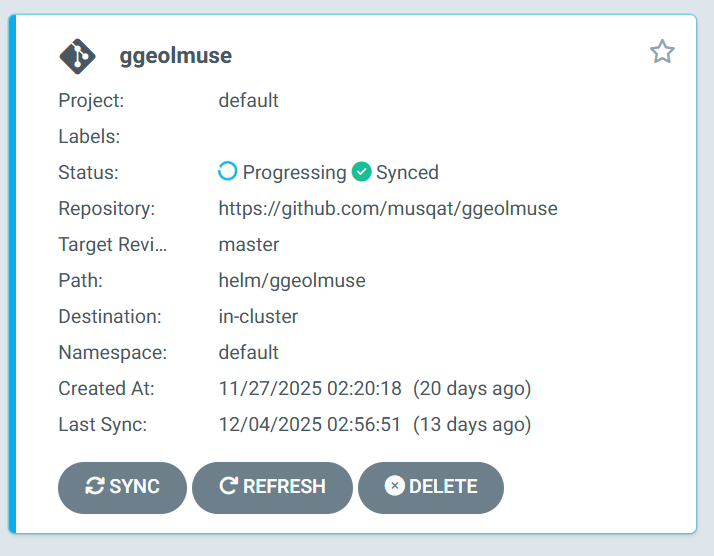
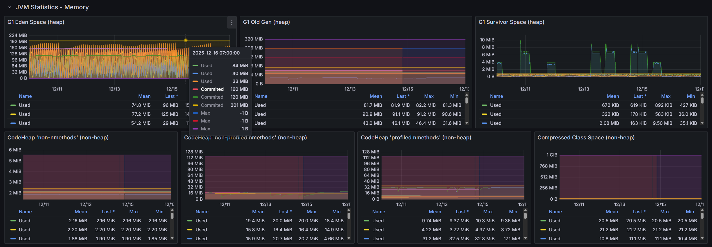

# Infrastructure & Deployment

## 인프라 아키텍처

### AWS 구성

```
AWS EC2 (t3.large, 8GB RAM + 2GB Swap)
├── Cloudflare (DNS, SSL, DDoS 방어)
│
└── K3s Cluster
    │
    ├── Ingress (Traefik)
    │
    ├── GitOps
    │   └── ArgoCD
    │
    ├── Monitoring Stack
    │   ├── Prometheus (메트릭 수집)
    │   ├── Grafana (시각화)
    │   ├── Loki (로그 집계)
    │   ├── Tempo (분산 추적)
    │   └── OpenTelemetry (계측)
    │
    ├── Infrastructure Pods
    │   ├── Kafka + Zookeeper (이벤트 버스)
    │   ├── Redis (캐시)
    │   └── Keycloak (인증)
    │
    └── Application Pods
        ├── gateway-server
        ├── config-server
        ├── user-service
        ├── trade-service
        ├── market-data-service
        ├── backtest-service
        └── frontend

AWS RDS (db.t3.micro)
└── PostgreSQL (Single-AZ)
```

### 외부 서비스

| 서비스 | 용도 | 비고 |
|--------|------|------|
| Cloudflare | DNS, SSL, CDN | 무료 플랜 |
| RDS PostgreSQL | 데이터베이스 | db.t3.micro, Single-AZ |
| Route 53 | 도메인 관리 | 호스팅 영역 |
| Secrets Manager | 시크릿 관리 | API 키, DB 비밀번호 |

---

## 비용 최적화

### 초기 계획 vs 최종 선택

| 구성 | 초기 계획 | 최종 선택 | 절감 |
|------|----------|----------|------|
| Kubernetes | EKS ($73/월) | K3s (EC2만) | -$73 |
| Database | RDS Multi-AZ ($100/월) | RDS Single-AZ ($15/월) | -$85 |
| Cache | ElastiCache ($50/월) | Pod 내 Redis | -$50 |
| Message Queue | MSK ($300/월) | Pod 내 Kafka | -$300 |
| Load Balancer | ALB ($20/월) | Cloudflare (무료) | -$20 |
| **합계** | **$650+/월** | **$80/월** | **87% 절감** |

### 선택 근거

**상황**: 개인 프로젝트, 트래픽 적음

**트레이드오프**:
| 포기한 것 | 유지한 것 |
|----------|----------|
| 고가용성 (Multi-AZ) | 마이크로서비스 구조 |
| 자동 스케일링 | 컨테이너화 (Docker + K8s) |
| 관리형 서비스 (EKS, MSK) | Event-Driven 아키텍처 |
| 무중단 배포 | 모니터링 (Grafana Stack) |

**스케일업 경로**:
```
현재 ($80/월)
  ↓ 트래픽 증가 시
EC2 스펙 업그레이드 ($120/월)
  ↓ 더 증가 시
EKS + Multi-Node ($300/월)
  ↓ 본격 서비스 시
EKS + RDS Multi-AZ + ElastiCache ($800/월)
```

values 파일만 수정하면 EKS 전환 가능.

---

## CI/CD 파이프라인

### 전체 흐름

```
코드 푸시 (GitHub)
    │
    ▼
GitHub Actions (CI)
    ├── Maven 빌드 & 테스트
    ├── 보안 스캔 (Trivy, OWASP)
    └── Docker 이미지 빌드 → GHCR 푸시
    │
    ▼
ArgoCD (CD)
    ├── Git 변경 감지 (values-prod.yaml)
    └── Helm 배포 → K3s 클러스터
```

### Values 구조 (환경 분리)

```
values.yaml             공통 (환경 무관: 이미지 레지스트리, 포트, kafka, 토픽, probe/resource 기본값)
values-dev.yaml         로컬/dev 환경 설정 (app.localhost, nginx ingress, aws off, dev 프로파일) — 커밋함
values-prod.yaml        prod 환경 설정 (ggeolmuse.com, traefik, AWS Secrets Manager, prod 프로파일/리소스) — 커밋함
values-secret.yaml      로컬 시크릿 (secrets.enabled + 실제 키) — gitignore, .example 참고해 각자 생성
```

- 배포 시 반드시 환경 파일 지정:
  - 로컬: `helm ... -f values-dev.yaml -f values-secret.yaml` (환경설정 + 로컬시크릿)
  - 운영: `helm ... -f values-prod.yaml` (ArgoCD가 사용, 시크릿은 AWS Secrets Manager)
- `values.yaml`은 공통만 담으므로 단독 사용(no -f) 시 도메인/ingress 등이 비어 불완전.
- 이미지 tag: `values.yaml`은 tag 미지정 → `Chart.AppVersion` 일괄 사용(로컬), prod는 서비스별 명시.

### ArgoCD GitOps

values-prod.yaml 변경사항을 Git에 커밋하면 ArgoCD가 자동으로 감지하여 배포.

<div align="center">
  
</div>

```yaml
# argocd/application-ggeolmuse.yaml
spec:
  source:
    repoURL: https://github.com/musqat/ggeolmuse
    path: helm/ggeolmuse
    helm:
      valueFiles:
        - values.yaml
        - values-prod.yaml
```

---

## 모니터링

### Observability Stack

| 도구 | 역할 | 용도 |
|------|------|------|
| **Prometheus** | 메트릭 수집 | JVM, API 응답 시간, 에러율 |
| **Grafana** | 시각화 | 대시보드, 알림 |
| **Loki** | 로그 집계 | 에러 로그 검색, 디버깅 |
| **Tempo** | 분산 추적 | 서비스 간 요청 흐름 추적 |
| **OpenTelemetry** | 계측 | Trace/Metric 데이터 수집 및 전송 |

### Grafana - JVM 메트릭

<div align="center">
  
</div>

G1 GC 힙 메모리 사용량 모니터링 (Eden, Old Gen, Survivor Space)

### 주요 메트릭

```promql
# API 응답 시간 (P95)
histogram_quantile(0.95, rate(http_server_requests_seconds_bucket[5m]))

# 에러율 (%)
sum(rate(http_server_requests_seconds_count{status=~"5.."}[5m]))
/ sum(rate(http_server_requests_seconds_count[5m])) * 100

# JVM 힙 사용률
jvm_memory_used_bytes{area="heap"} / jvm_memory_max_bytes{area="heap"} * 100
```

---

## 트러블슈팅

### Rolling Update 중 OOM 발생

| 항목 | 내용 |
|------|------|
| **문제** | `helm upgrade` 실행 후 EC2 응답 불능 |
| **원인** | Kubernetes 기본 `maxSurge: 25%`로 배포 중 Pod 추가 생성 → 메모리 급증 |
| **해결** | `maxSurge: 0`, `maxUnavailable: 1`로 변경 |

```yaml
# values.yaml
deploymentStrategy:
  type: RollingUpdate
  rollingUpdate:
    maxSurge: 0        # 새 Pod 추가 생성 안 함
    maxUnavailable: 1  # 기존 Pod 1개 종료 후 새 Pod 생성
```

### JVM 메모리 과다 할당

| 항목 | 내용 |
|------|------|
| **문제** | t3.xlarge (16GB)에서도 메모리 부족 |
| **원인** | JVM 힙 미설정 → 컨테이너 메모리의 25% 기본 사용 |
| **분석** | Actuator metrics로 실측 → 실제 사용량 대비 5배 과다 할당 |

```bash
# 실측 결과
user-service: 실제 151MB 사용 중인데 768MB 할당
trade-service: 실제 150MB 사용 중인데 768MB 할당
gateway: 실제 75MB 사용 중인데 384MB 할당
```

| 서비스 | 기존 -Xmx | 최적화 -Xmx |
|--------|----------|-------------|
| market-data | 1024m | 768m |
| user-service | 768m | 256m |
| trade-service | 768m | 256m |
| backtest | 640m | 320m |
| gateway | 384m | 192m |
| config-server | 256m | 128m |

**결과**: t3.xlarge → t3.large 다운그레이드 (월 $92 절감)
