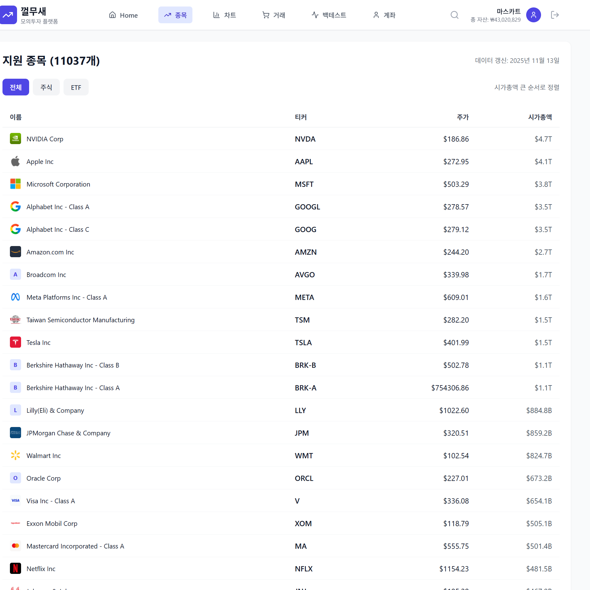
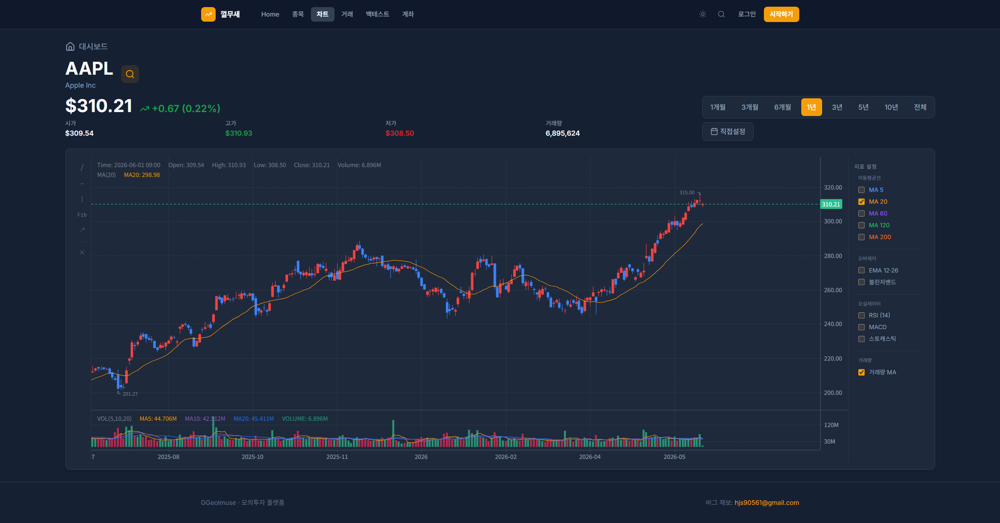

# Market Data Service

주식 시세 및 배당 데이터 수집/제공 서비스

## 주요 기능

- 11,000+ 미국 주식 종목 데이터 관리 (NYSE, NASDAQ, NYSE ARCA)
- 20년치 일별 OHLC 데이터 수집
- 실시간 시세 조회 (Redis 캐싱)
- 배당금 정보 제공
- USD/KRW 환율 데이터 수집

## 시스템 내 역할

**책임:**
- Alpha Vantage API Rate Limit (75/min) 극복 (Kafka 병렬 처리)
- Trade/Backtest Service에 시세 정보 제공
- Redis 캐싱으로 API 부하 절감 (Hit Rate 85~99%)
- 환율 변동 시 Kafka 이벤트 발행

**의존 서비스:**
- Alpha Vantage API: 주식 데이터 수집
- Kafka: 비동기 데이터 수집 파이프라인
- Redis: 실시간 조회 캐싱

## 데이터 수집 전략

### Kafka 병렬 처리
1. AssetCreatedEvent 발행 (종목별)
2. 3개 Consumer가 병렬로 데이터 수집
3. RateLimiter로 API 호출 간격 조정 (75 calls/min)
4. 실패 시 자동 재시도

### Redis 캐싱
- 실시간 가격: 30초 TTL (Hit Rate 85%)
- 과거 데이터: 24시간 TTL (Hit Rate 98%, 불변 데이터)
- 환율: 24시간 TTL (Hit Rate 99%)

## 화면

### 주식 페이지

11,000+ 종목의 실시간 시세와 시가총액을 조회할 수 있습니다.

### 차트 페이지

20년치 OHLC 데이터를 활용한 인터랙티브 차트를 제공합니다.
