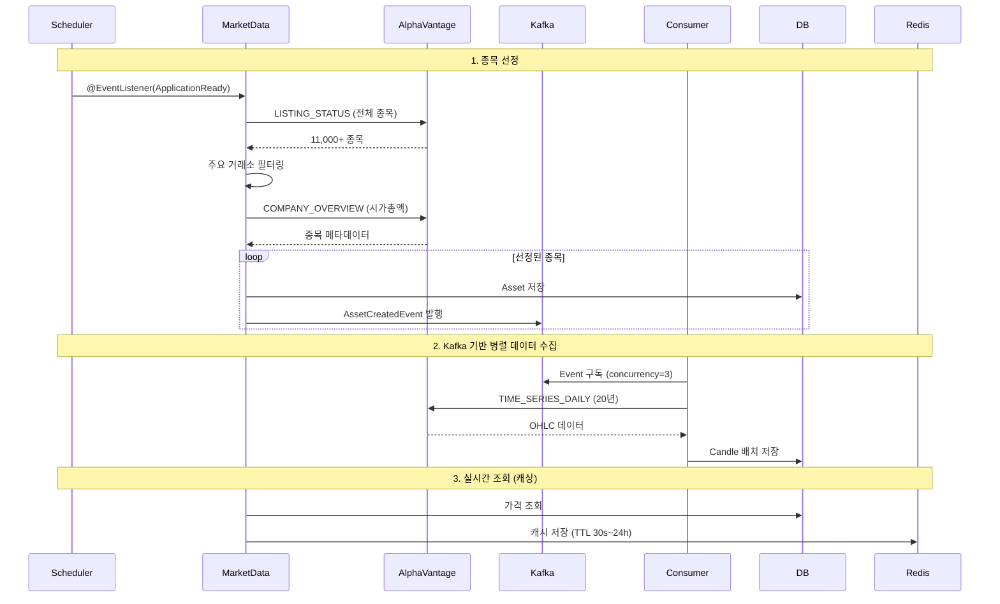

# Market Data Service

주식 시세 및 배당 데이터 수집/제공 서비스

## 주요 기능
- 11,000+ 미국 주식 종목 데이터 관리 (NYSE, NASDAQ, NYSE ARCA)
- 시가총액 기반 종목 선정 (설정 가능, 기본값: 무제한)
- 20년치 일별 OHLC 데이터 수집 (Alpha Vantage API)
- 실시간 시세 조회 (Redis 캐싱)
- 배당금 정보 제공
- USD/KRW 환율 데이터 수집

## 시스템 내 역할

**시스템 내 책임:**
- 데이터 수집: Alpha Vantage API Rate Limit (75/min) 극복 (Kafka 병렬 처리)
- 데이터 제공: Trade/Backtest Service에 시세 정보 제공
- 캐싱 전략: Redis 5-tier 캐싱으로 API 부하 절감 (Hit Rate 85~99%)
- 이벤트 발행: 환율 변동 시 Kafka 이벤트 발행 (User/Trade Service 구독)

**의존 서비스:**
- Alpha Vantage API: 주식 데이터 (OHLC, 배당, 시가총액)
- Kafka: 비동기 데이터 수집 파이프라인
- Redis: 실시간 조회 캐싱

## 데이터 수집 프로세스

### Phase 1: 종목 선정 (애플리케이션 시작 시)
1. LISTING_STATUS API로 11,000+ 종목 조회
2. 주요 거래소 필터링 (NYSE, NASDAQ, NYSE ARCA)
3. COMPANY_OVERVIEW API로 시가총액 확인 (Rate Limit: 75/min)
4. Asset 테이블 저장 → AssetCreatedEvent 발행

### Phase 2: 병렬 데이터 수집 (Kafka Consumer)
1. 3개 Consumer가 Event 구독 (concurrency=3)
2. TIME_SERIES_DAILY API로 20년치 데이터 수집
3. Candle 테이블 배치 저장 (선정된 종목 × 5,000일/종목)
4. 처리 시간: Rate Limit에 따라 가변적 (75 calls/min)

### Phase 3: 일일 업데이트 (스케줄러)
- 매일 오전 9시 (KST): 환율 업데이트
- 매일 새벽 3시 (EST): 전일 종가 업데이트

## Redis 캐싱 전략

| Cache Key | TTL | Hit Rate | Use Case |
|-----------|-----|----------|----------|
| `currentPrice:{symbol}` | 30s | 85% | 실시간 가격 조회 |
| `stockPrices` | 5m | 92% | 주식 목록 |
| `ohlcPriceRange:{symbol}:{start}:{end}` | 24h | 98% | 백테스트 (과거 데이터 불변) |
| `fxRate:{date}` | 24h | 99% | 환율 (일 1회 갱신) |

**Cache Eviction:**
환율 업데이트 시 해당 날짜 캐시 무효화 후 Kafka 이벤트 발행

## API Rate Limit 극복 전략

**문제:** Alpha Vantage 유료 플랜 75 calls/minute

**해결책:**
1. **Kafka 비동기 처리**: 한 종목 실패가 전체에 영향 없음
2. **RateLimiter 적용**: API 호출 간격 자동 조정
3. **병렬 처리**: Consumer concurrency=3으로 동시 처리
4. **재시도 로직**: Kafka Consumer 자동 재시도

## 데이터베이스 스키마

주요 테이블:
- `asset`: 종목 정보 (symbol, name, market_cap, active)
- `candle`: 일별 OHLC 데이터 (2.9M+ rows, 20년치)
- `dividend`: 배당 정보 (ex_date, amount, symbol)
- `fx_rate`: 환율 데이터 (date, usd_to_krw)

**데이터 규모:**
- Asset: 11,000+ 종목 (주요 거래소)
- Candle: 수백만 rows (종목 수 × 20년 × 252영업일)
- Dividend: 배당 지급 이력
- FxRate: ~3,000 rows (10년치)
