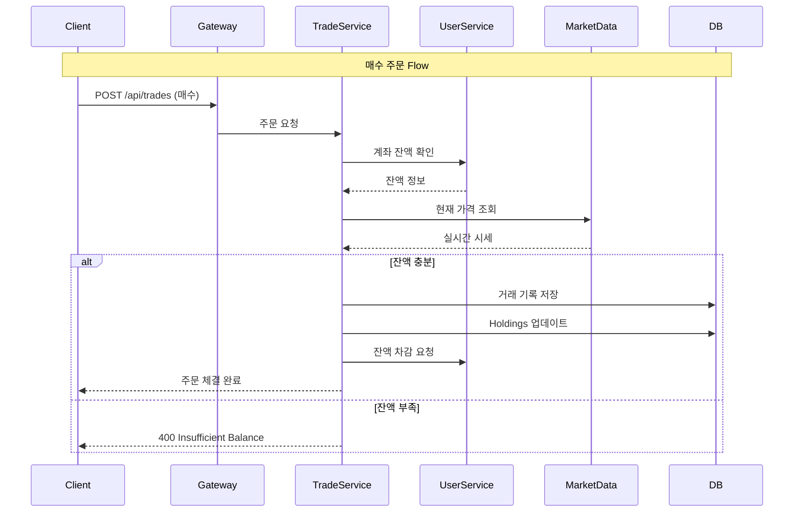

# Trade Service

주식 거래 및 포트폴리오 관리 서비스

## 주요 기능
- 주식 매수/매도 주문 실행
- 포트폴리오 조회 및 평가액 계산
- 보유 종목(Holdings) 관리 (FIFO 방식)
- 배당금 자동 지급 및 재투자
- 거래 내역 조회 및 통계

## 시스템 내 역할

**시스템 내 책임:**
- 거래 실행: 매수/매도 주문 처리 및 수수료/슬리피지 적용
- 포트폴리오 관리: 실시간 평가액 계산 (현재가 × 보유 수량)
- FIFO 정산: 매도 시 먼저 매수한 주식부터 차감
- 배당 처리: Market Data Service의 배당 정보로 자동 지급
- 이벤트 구독: 환율 변동 시 포트폴리오 재계산

**의존 서비스:**
- User Service: 계좌 잔액 조회/업데이트 (Feign Client)
- Market Data Service: 실시간 시세, 배당 정보 (Feign Client)
- Kafka: 환율 변동 이벤트 구독

## 데이터베이스 스키마

주요 테이블:
- `trades`: 거래 내역 (symbol, quantity, price, fee)
- `holdings`: 보유 종목 (total_quantity, avg_purchase_price)
- `dividends`: 배당 지급 내역 (gross_amount, tax_amount, net_amount)

## 비즈니스 로직

**매수 프로세스:**
1. 계좌 잔액 검증 (총 금액 = 가격 × 수량 + 수수료)
2. 실시간 시세 조회 (slippage 적용)
3. 거래 기록 저장
4. Holdings 업데이트 (평균 매수가 재계산)
5. User Service에 잔액 차감 요청

**매도 프로세스 (FIFO):**
1. 보유 수량 검증
2. FIFO 방식으로 손익 계산
3. 거래 기록 저장
4. Holdings 업데이트 (수량 차감)
5. User Service에 잔액 증가 요청
