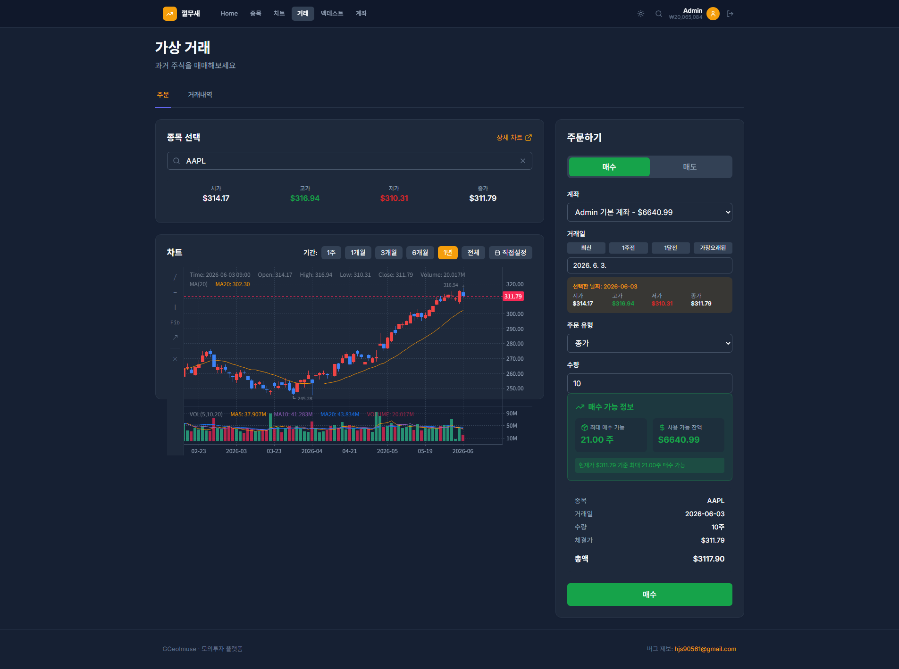
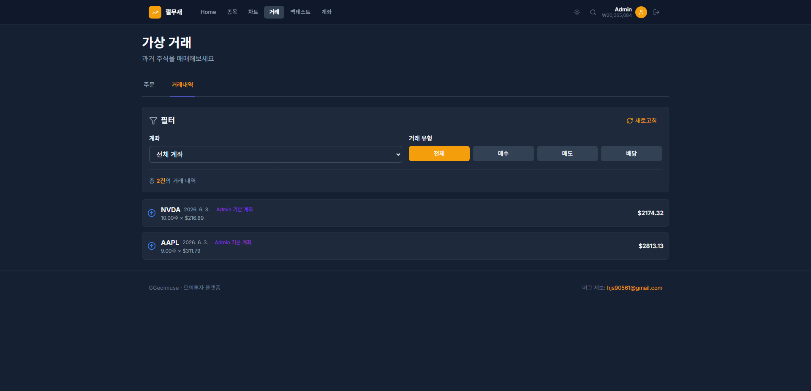
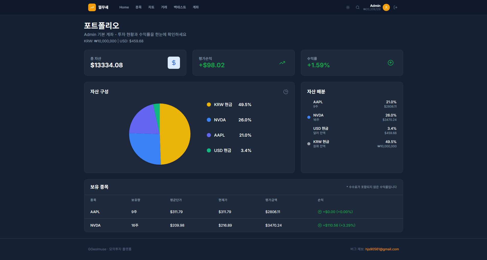

# Trade Service

주식 거래 및 포트폴리오 관리 서비스

## 주요 기능

- 주식 매수/매도 주문 실행
- 포트폴리오 조회 및 평가액 계산
- 보유 종목(Holdings) 관리 (FIFO 방식)
- 배당금 자동 지급 및 재투자
- 거래 내역 조회 및 통계

## 시스템 내 역할

**책임:**
- 매수/매도 주문 처리 및 수수료/슬리피지 적용
- 실시간 평가액 계산 (현재가 × 보유 수량)
- FIFO 방식 손익 정산
- Market Data Service의 배당 정보로 자동 지급
- 환율 변동 이벤트 구독 (포트폴리오 재계산)

**의존 서비스:**
- User Service: 계좌 잔액 조회/업데이트
- Market Data Service: 실시간 시세, 배당 정보
- Kafka: 환율 변동 이벤트 구독

## 핵심 비즈니스 로직

### 매수 프로세스
1. 계좌 잔액 검증 (가격 × 수량 + 수수료)
2. 실시간 시세 조회 (slippage 적용)
3. Holdings 업데이트 (평균 매수가 재계산)
4. 잔액 차감

### 매도 프로세스 (FIFO)
1. 보유 수량 검증
2. FIFO 방식으로 손익 계산 (먼저 매수한 주식부터 차감)
3. Holdings 업데이트
4. 잔액 증가

## 화면

### 거래 페이지

실시간 차트와 함께 매수/매도 주문을 실행할 수 있습니다.

### 거래 내역

과거 거래 내역과 손익을 확인할 수 있습니다.

### 포트폴리오

보유 종목의 실시간 평가액과 수익률을 조회합니다.
