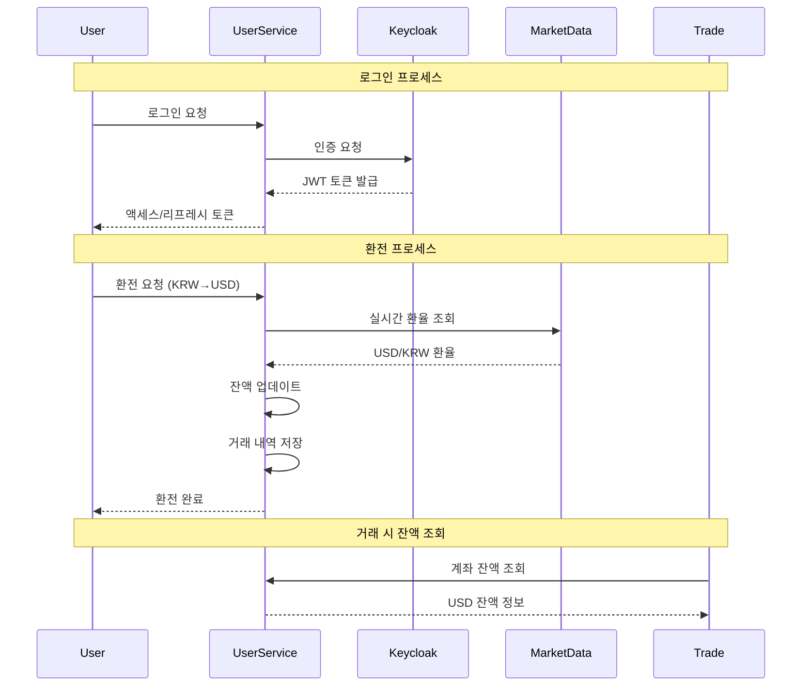

# User Service

사용자 인증 및 계좌 관리 서비스

## 주요 기능
- Keycloak 기반 인증 (Email/Password, Google/Kakao/Naver OAuth2)
- 사용자 회원가입 및 이메일 인증
- 투자 계좌 생성 및 잔액 관리
- 환전 기능 (KRW ↔ USD)
- 계좌 거래 내역 추적

## 시스템 내 역할

**책임:**
- Keycloak 연동 JWT 토큰 발급 및 검증
- Trade Service에 계좌 잔액 정보 제공
- 실시간 환율 적용 (환율 변동 이벤트 구독)
- 계좌 잔액 변경 이벤트 발행

**의존 서비스:**
- Keycloak: 인증 서버
- Market Data Service: 환율 정보 조회

## 화면

### 계좌 관리

원화/달러 잔액 조회, 입금, 환전 기능을 제공합니다.

