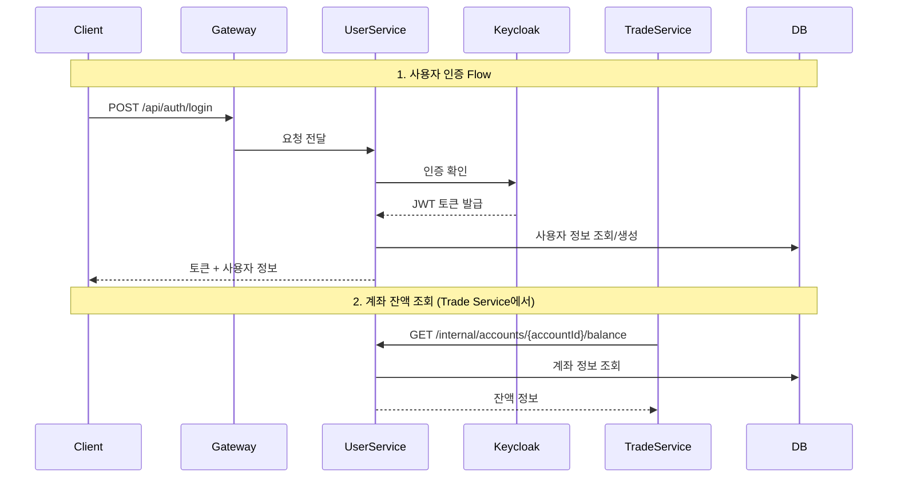

# User Service

사용자 인증 및 계좌 관리 서비스

## 주요 기능
- Keycloak 기반 인증 (Email/Password, Google/Kakao/Naver OAuth2)
- 사용자 회원가입 및 이메일 인증
- 투자 계좌 생성 및 잔액 관리
- 환전 기능 (KRW ↔ USD)
- 계좌 거래 내역 추적 및 입출금 관리

## 시스템 내 역할

**시스템 내 책임:**
- 인증/인가: Keycloak과 연동하여 JWT 토큰 발급 및 검증
- 계좌 관리: Trade Service에 계좌 잔액 정보 제공 (Feign Client)
- 환전 처리: 환율 변동 이벤트 구독하여 실시간 환율 적용
- 이벤트 발행: 계좌 잔액 변경 시 Kafka 이벤트 발행

**의존 서비스:**
- Keycloak: 인증 서버
- Market Data Service: 환율 정보 조회
- Kafka: 잔액 변경 이벤트 발행

## 데이터베이스 스키마

주요 테이블:
- `users`: 사용자 정보 (email, keycloak_id, role)
- `account`: 투자 계좌 (balance_krw, balance_usd, 수수료율)
- `account_history`: 입출금/환전 내역
- `email_verification_tokens`: 이메일 인증 토큰
- `password_reset_tokens`: 비밀번호 재설정 토큰

