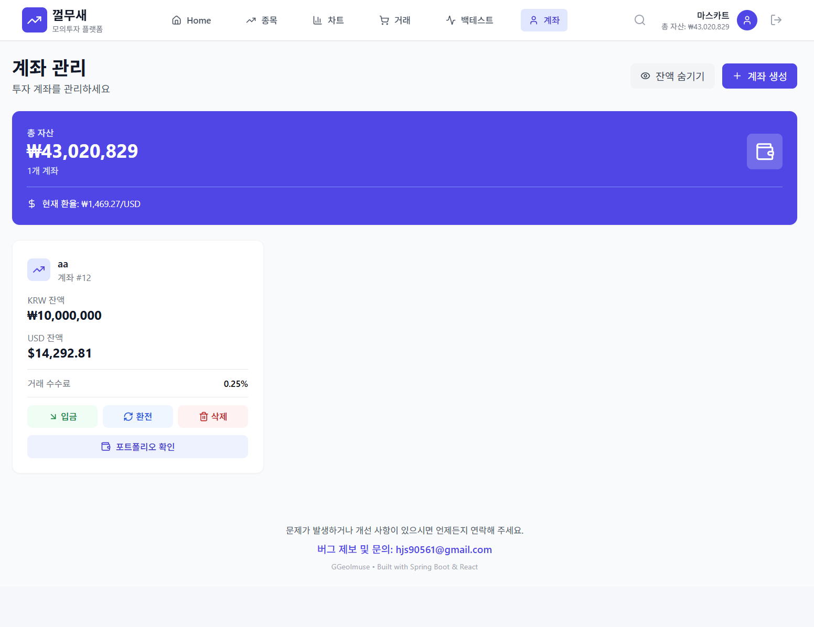

# User Service
사용자 인증 및 계좌 관리 서비스

## 주요 기능
- Keycloak 기반 인증 (Email/Password, Google OAuth2)
- 사용자 회원가입 및 이메일 인증
- 투자 계좌 생성 및 잔액 관리
- 환전 기능 (KRW ↔ USD)
- 계좌 거래 내역 추적

## 시스템 내 역할

**핵심 기능:**
- Keycloak 기반 인증 및 JWT 토큰 관리
- 계좌 생성 및 잔액 관리 (KRW/USD)
- 환전 기능 (일별 환율 데이터 또는 수동 설정)

**의존 서비스:** Keycloak, Market Data Service

## 화면

### 계좌 관리

원화/달러 잔액 조회, 입금, 환전 기능을 제공합니다.

